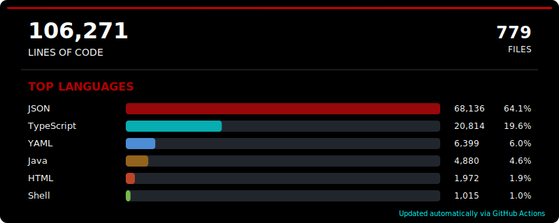
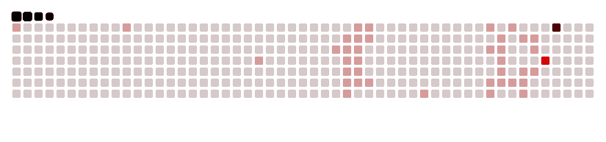

<!-- Profile Trophies -->

    

<!-- LOC Stats SVG -->

<!-- LOC-STATS:START -->

<!-- LOC-STATS:END -->

<!-- Github Stats -->

     <strong>Github Stats</strong>

<table align="center">
<tr>
<td width="50%" align="center">
    
</td>
<td width="50%" align="center">
    
</td>
</tr>
</table>

 

  **Skills**

### Tools:

### Development Environments:

<!-- Social Links -->

  
  
 <!--  -->

 ***About me***

🎓 As a holder of a Master’s degree in Cybersecurity, my primary focus is on building and defending secure digital environments. I am now channeling my professional energy from web development to specialize deeply in the field of security.

My prior experience in developing full-stack applications gives me a practical understanding of how systems are built, which I now leverage to identify and mitigate vulnerabilities effectively. I am driven by the challenge of architecting and implementing robust security solutions.

To further my expertise, I am currently focused on:

- 🧙‍♂️ I’m currently learning ...
  -   *Shell scripting*
  -   *Advanced Python for penetration testing and analysis*
  -   *Linux system hardening and administration*
- 👻 I am a fast and continuous learner, taking a methodical, step-by-step approach to mastering new skills..
- 🫡 I am actively seeking opportunities where I can apply my dedicated cybersecurity knowledge and contribute to creating resilient, secure systems. I'm always open to connecting with fellow security professionals.
- 😎 Reach out to me at: <a href="medboukthir7@gmail.com">medboukthir7@gmail.com</a>
- 👽 [Portfolio](https://mohamedboukthir.vercel.app/)
 

<table>
<tr>
<td width="200px">

</td>
<td>

</td>
</tr>
</table>

